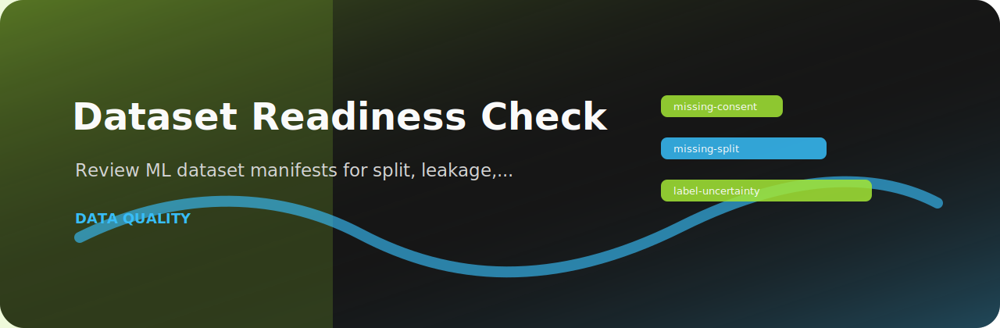

# Dataset Readiness Check



> Review ML dataset manifests for split, leakage, label, and consent readiness

   

## At a glance

| Area | Detail |
| --- | --- |
| Focus | dataset readiness |
| Command | `dataset-readiness-check` |
| Formats | text, JSON, JSONL, CSV |
| Output | Markdown table or JSON |

## What it checks

| Rule | Severity | What it catches |
| --- | --- | --- |
| `missing-consent` | high | dataset usage rights are unclear |
| `missing-split` | medium | dataset split is incomplete |
| `label-uncertainty` | low | label quality is uncertain |

## Try it locally

```bash
python -m pip install -e ".[dev]"
dataset-readiness-check examples/sample.txt
dataset-readiness-check examples/sample.txt --json --fail-on medium
```

## Notes from the code

`rules.py` keeps the project policy explicit, while `core.py` handles parsing and report rendering. The CLI stays thin on purpose so the checks are easy to test.

## Verify

```bash
python -m pip install -e ".[dev]"
ruff check .
pytest
python -m dataset_readiness_check --help
```
