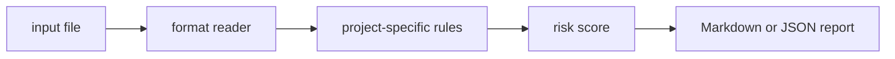

# dataset-readiness-check

`dataset-readiness-check` is a small local CLI that review ML dataset manifests for split, leakage, label, and consent readiness.

## Why it is useful

ML datasets need basic readiness checks before modeling. This CLI highlights missing splits, label uncertainty, and governance gaps.

## Key features

- reads text, JSON, JSONL, or CSV inputs
- returns Markdown or JSON reports
- supports severity-based CI exit codes
- keeps all checks deterministic and offline
- includes focused rules for this project:
- `missing-consent`: dataset usage rights are unclear
- `missing-split`: dataset split is incomplete
- `label-uncertainty`: label quality is uncertain

## Installation

```bash
python -m pip install -e ".[dev]"
```

## Usage

```bash
dataset-readiness-check examples/sample.txt
dataset-readiness-check examples/sample.txt --json
dataset-readiness-check path/to/input.txt --fail-on medium --out report.md
python -m dataset_readiness_check --help
```

Example input:

```text
labels unknown train only consent missing leakage possible
```

## CLI options

```text
dataset-readiness-check INPUT [--format auto|text|jsonl|csv|json] [--json]
             [--fail-on low|medium|high] [--out PATH]
```

`INPUT` is any dataset manifest or README text. The tool exits with code `2` when findings meet the selected
threshold, which makes it easy to use in GitHub Actions or release checks.

## Workflow



## Tests

```bash
ruff check .
pytest
python -m dataset_readiness_check --help
```

## License

MIT
