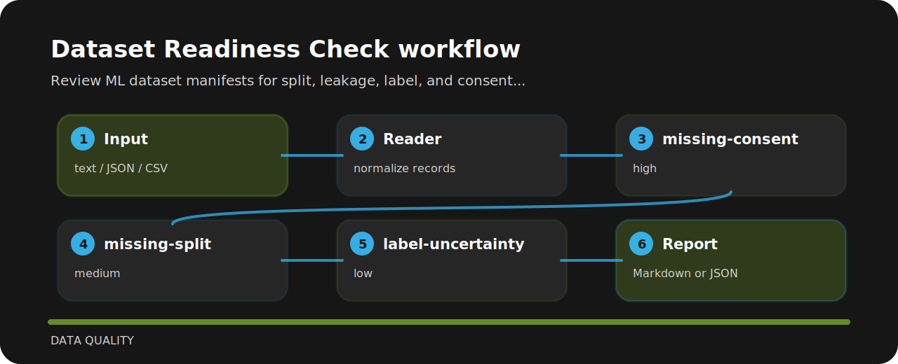

# Dataset Readiness Check

Review ML dataset manifests for split, leakage, label, and consent readiness.


## Policy flow



## Signals

- `missing-consent` - dataset usage rights are unclear (high); Document license, consent, or approved usage basis..
- `missing-split` - dataset split is incomplete (medium); Create train, validation, and test splits..
- `label-uncertainty` - label quality is uncertain (low); Record labeling method and review sample quality..

## Code trail

```text
.github/        CI workflow
examples/       sample inputs
src/            package source
tests/          test coverage
```

## Local check

```bash
git clone https://github.com/mertefekurt/dataset-readiness-check.git
cd dataset-readiness-check
python -m pip install -e ".[dev]"
dataset-readiness-check examples/sample.txt
```
